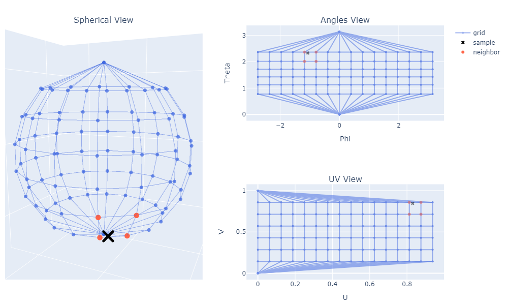

# sphere-mapping
Demonstrate bijective sphere-plane mappings with interactive visualization.

<figure>

<figcaption align = "center"><b>Uniform area sphere to plane projection. There different views showing grid, a random sample and its neigbors on the grid. </b></figcaption>
</figure>


### Environment setup

- [Anaconda](https://www.anaconda.com/), for environment management.

```
    conda env create -f environment.yaml
    conda activate sphere-mapping
```

### Usage

- CLI

```
    python main.py -h
    python main.py -m uniform_area
```

- Or [Notebook](graph.ipynb).